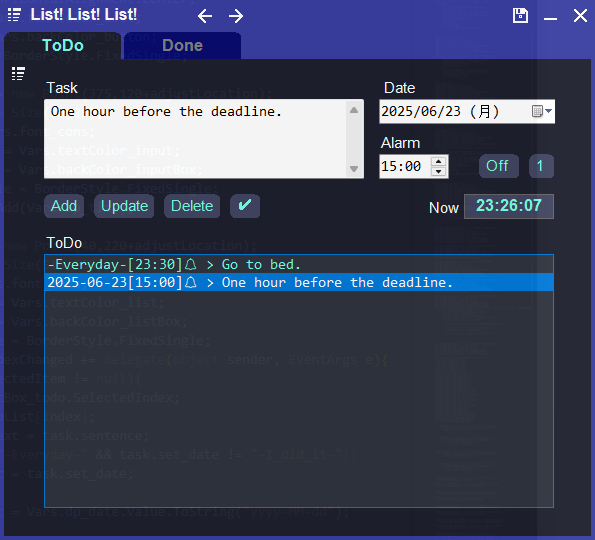
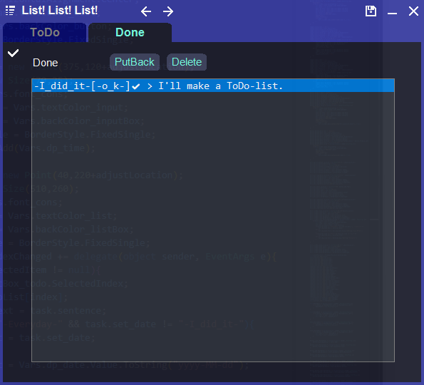

# List!List!List!

List!List!List! is a simple To-Do-list with alarm function made in C#.

Although it only has one source file and some assets, it has the following features:

* It can add, change, delete, save, or load tasks. 
* Chenge it use alarm turn ON or OFF. 
* Chose designated day or Everyday. 
* Put back or delete completed tasks. 
* undo,redo. 
  

